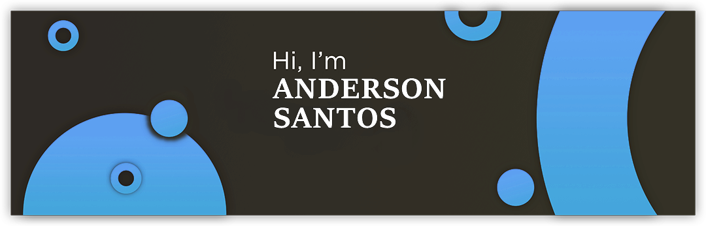

<!--# 
Bem-vindo, Sou Anderson Santos!
-->

Essas são algumas das linguagens e frameworks que obtive contato e continuo estudando.   
<a href="https://github.com/azsantoss">

 

 
  
 
  
 

</a>
  
<!--Sou apaixonado por tecnologias, formas e códigos. tento manter minhas Habilidades sempre aperfeiçoadas e atualizadas.
- [Blog](https://github.com/azsantoss) ✍🏼 - Notações, Artigos (Base de conhecimento).
- [Website](https://azsantoss.github.io/portfolio/) 💻 - Portifolio profissional-->

   
  <!--
   
  Total de acessos a página - AzSantoss
   
  -->

## 

Estatísticas do GitHub e principais linguagens  
  
  

